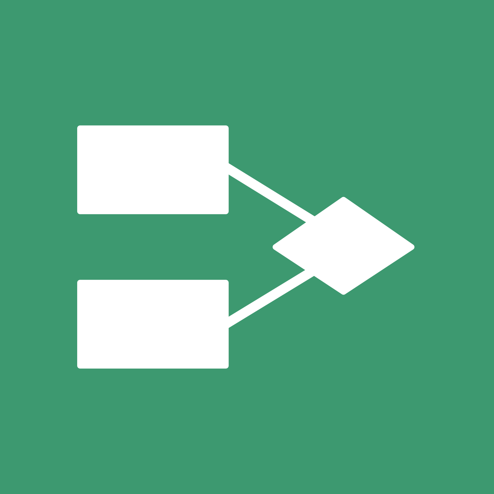

 
 

 
 
<h3>About me: 💬 </h3>
 <h4>💼 - Today front-end study  
📚 - Studying HTML,CSS and JavaScript  
⚡ - Fun fact: I'm addicted to coffee..."  
🇧🇷 - Brazilian </h4> 

<h5 align="center">⚡️ INFORMATION ⚡️ </h5>  

  <a href="https://github.com/eucesar">
   
  

 

 
<h6> 👨🏻‍💻 MY SKILLS 👨🏻‍💻 </h6>
  
  
  
  
  
  
  
  
  
  
  
  
  
  
  
  
  
  

 
  

  
  

  

<h6>📫 CONTACT 📫<h6>

 

**
