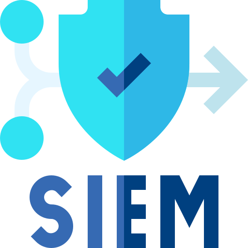
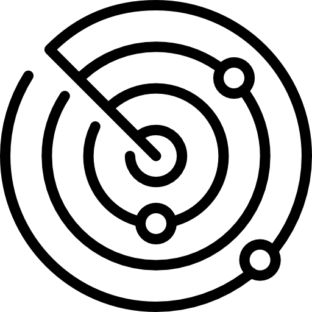
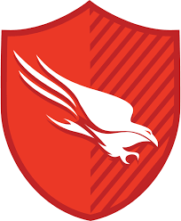
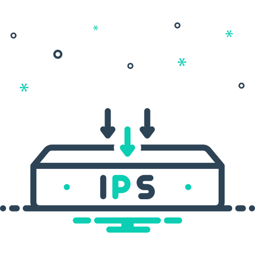
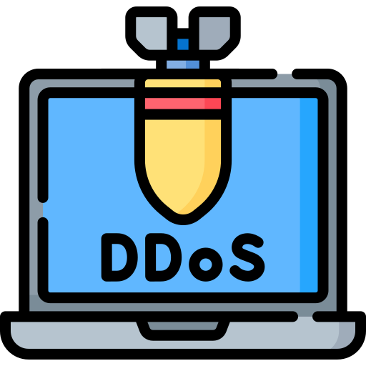
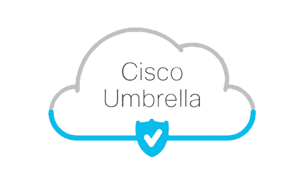
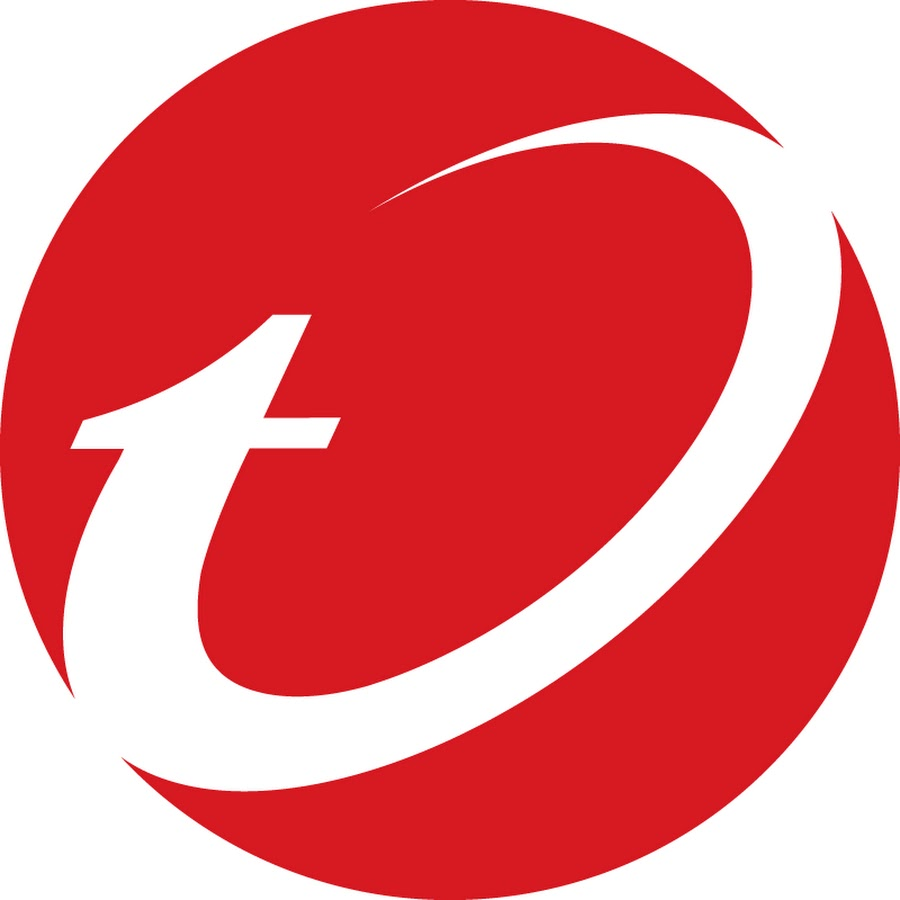
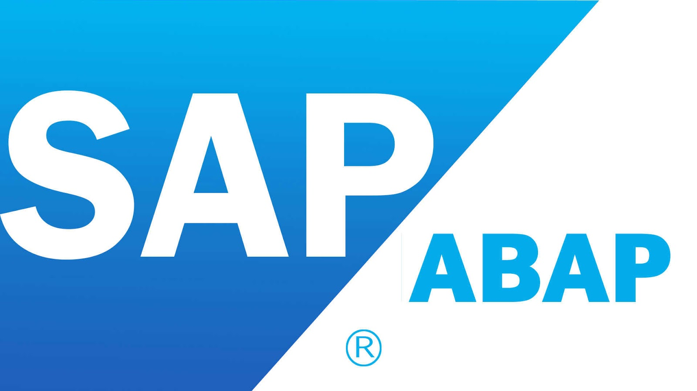

  

I'm Cesar Iglesias, an Information Systems student focused on cybersecurity, with hands-on experience in SOC and Blue Team operations, working with security monitoring, alert analysis, and incident response using SIEM platforms such as IBM QRadar and Google SecOps, EDR with CrowdStrike Falcon, and SOAR automation via IBM QRadar SOAR, along with technologies like Telmix IPS, F5 and Akamai WAF, UPX Anti-DDoS, Trend Micro email security, and OpenDNS / Cisco Umbrella. I am currently a Cyber Security intern in the Security Operations Center (SOC) at Bradesco, where I actively participate in incident investigation, war rooms, threat response, and operational security processes in a hybrid enterprise environment.

 
<h2 align="center">💬 About me: 💬 </h2>
<h3>
🛡️ - Cybersecurity Intern – SOC @ Bradesco  
👨‍💻 - Blue Team | Incident Response | Threat Detection  
🎓 - Information Systems Student (FIAP – 7th Semester / Final Year)  
🧠 - Hands-on experience with SIEM, EDR, SOAR and enterprise security tools  
☕ - Fun fact: Coffee-powered during incident response   

🌐 - Digital Card: https://digital-card-eucesar.vercel.app  
💻 - GitHub: https://github.com/eucesar  
🇧🇷 Brazilian </h3>

<h2 align="center">🛡️ Cybersecurity Stack & SOC Tools 🛡️</h2>

  <code></code>
  <code></code>
  <code></code>
  <code></code>
  <code></code>
  <code></code>
  <code></code>
  <code></code>
  <code></code>
  <code></code>

 
  
<h2 align="center"> 👨🏻‍💻 Developer Skills 👨🏻‍💻 </h2>

<code></code>
<code></code>
<code></code>
<code></code>
<code></code>
<code></code>
<code></code>
<code></code>
<code></code>
<code></code>
<code></code>
<code></code>
<code></code>
<code></code>

 

<h2 align="center">⚡️ Information ⚡️ </h2>  

  <a href="https://github.com/eucesar">
   
  

<h3 align="left">Connect with me!</h3>

 
