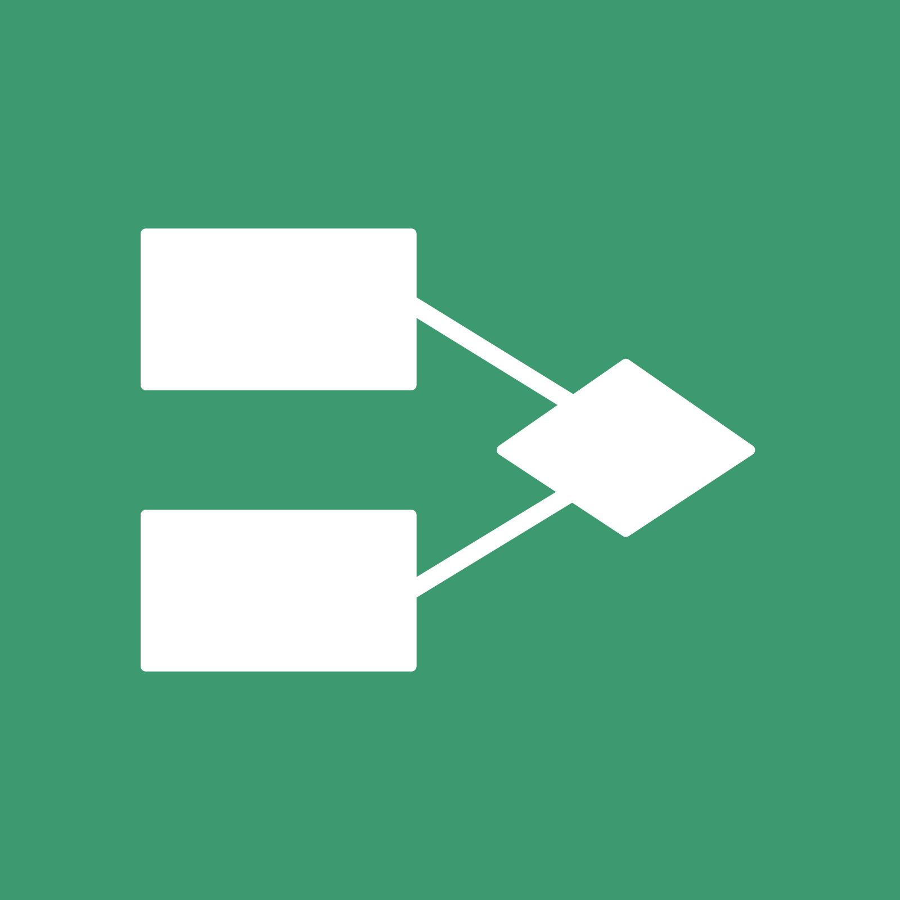

  

 
ola
 
 
<h2 align="center">💬 About me: 💬 </h2>
 <h3>
💼 - Today I'm Cybersecurity Intern at Bradesco  
📚 - Studying Programming Languages (Alura)  
👨‍🎓 - Studying Information Systems (FIAP - 5rd Semester)  
⚡ - Fun fact: I'm addicted to coffee..."  
Digital Card - https://digital-card-eucesar.vercel.app  
🇧🇷 - Brazilian </h3>  

<h2 align="center">⚡️ Information ⚡️ </h2>  

  <a href="https://github.com/eucesar">
   
  

 

 
<h2 align="center"> 👨🏻‍💻 My Skills 👨🏻‍💻 </h2>
   <code></code>
   <code></code>
   <code></code>
   <code></code>
   <code></code>
   <code></code>
   <code></code>
   <code></code>
   <code></code>
   <code></code>
   <code></code>
   <code></code>
   <code></code>
   <code></code>
   <code></code>
   <code></code>
   <code></code>
   <code></code>
   <code></code>
   <code></code>
   <code></code>
   <code></code>
   <code></code>

 
